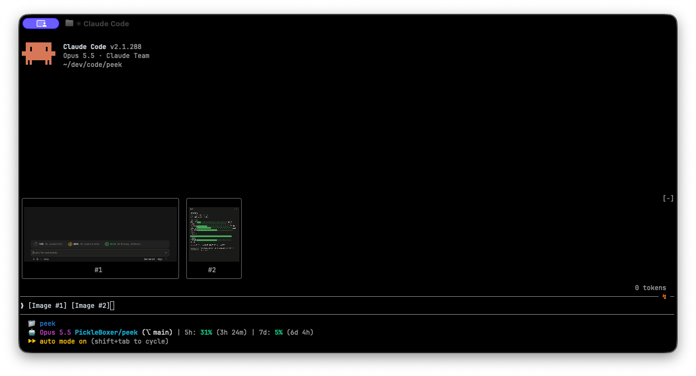

# peek

A [Claude Code mod](https://code.claude.com/docs/en/plugins/mods/overview) that shows the images you paste as thumbnails above the prompt, instead of bare `[Image #1]` tags.



- **Tiles above the prompt**: one per pasted image, labelled with the number of its tag. They appear as you paste, keep the image's shape (wide screenshots stay wide, phone shots stay tall) and shrink so the row always fits.
- **Follows the draft**: deleting a tag drops its tile, sending the prompt clears the row.
- **PNG, JPEG, GIF and WebP**: anything other than PNG is converted once with `sips`, so those previews are macOS only.

The Desktop app already previews pasted images, so peek draws nothing there.

## Requirements

- Claude Code v2.1.287 or later
- A terminal that draws images: [Ghostty](https://ghostty.org), [kitty](https://sw.kovidgoyal.net/kitty/), iTerm2 or WezTerm. Other terminals show a "no preview" tile.
- macOS for JPEG, GIF and WebP previews (PNG works everywhere)
- Inside tmux or screen, Claude Code turns images off. Set `CLAUDE_CODE_FORCE_TERMINAL_IMAGES=1` in your environment, and `set -g allow-passthrough on` for tmux.

## Install

```
/plugin marketplace add PickleBoxer/peek
/plugin install peek@peek
```

## Where the images come from

- **The image cache**: Claude Code saves each pasted image to `<tmp>/claude-<uid>/<project>/<session>/images/<n>.<ext>` and puts an `[Image #n]` tag in the prompt. peek finds the folder by the session id and draws each file with Claude Code's `Image` element. The terminal reads the file itself, so the image data never passes through the mod.
- **The prompt**: pasting raises no edit event, so peek reads the prompt every 200ms to see which tags are in it.
- **Converted copies** of non-PNG images are written next to the originals, inside the cache folder only your user can open.

The cache path is internal to Claude Code, so if a release moves it the tiles say "no preview" until peek is updated.

## Development

```
claude --plugin-dir .          # loads the mod and reloads it on save
claude plugin validate .claude-plugin/plugin.json
claude plugin test .
```

## Credits

Inspired by [claude-image-view](https://github.com/jarrodwatts/claude-image-view) by Jarrod Watts, which first found that a paste raises no edit event and that the draft has to be polled instead.

## License

MIT
